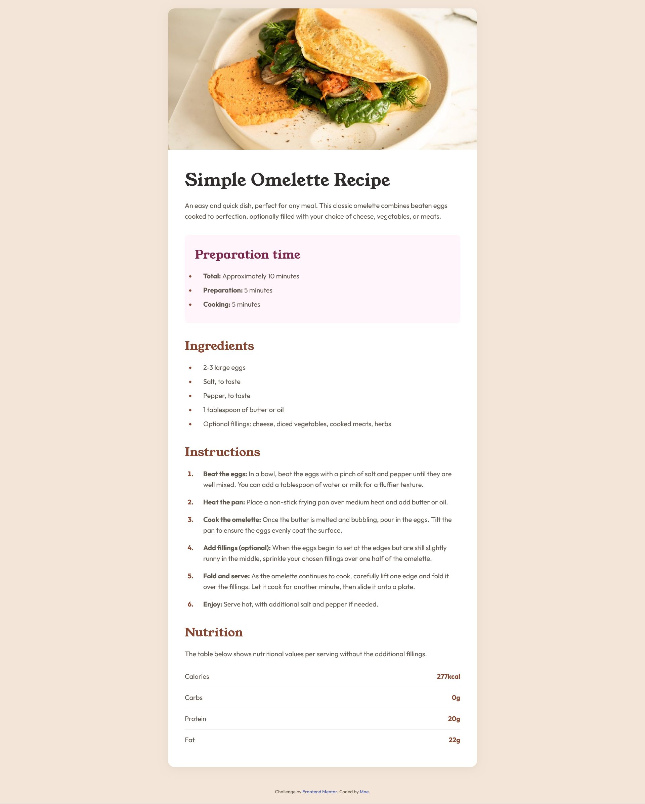
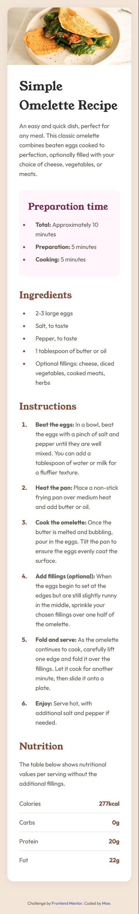

# Frontend Mentor - Recipe page solution

This is a solution to the [Recipe page challenge on Frontend Mentor](https://www.frontendmentor.io/challenges/recipe-page-KiTsR8QQKm). Frontend Mentor challenges help you improve your coding skills by building realistic projects.

## Table of contents

- [Overview](#overview)
  - [The challenge](#the-challenge)
  - [Screenshot](#screenshot)
  - [Links](#links)
- [My process](#my-process)
  - [Built with](#built-with)
  - [What I learned](#what-i-learned)
  - [Useful resources](#useful-resources)

## Overview

### Screenshot

#### Desktop View



#### Mobile View



### Links

- Solution URL: [Frontend Mentor Solution](https://www.frontendmentor.io/challenges/recipe-page-KiTsR8QQKm)
- Live Site URL: [Recipe Page](https://moefedaily.github.io/recipe-page-main/)

## My process

### Built with

- Semantic HTML5 markup - Using appropriate elements like `section`, `main`, and ordered lists
- CSS custom properties - Implemented a color system and typography variables in the root
- Flexbox - Used for layout structure and the nutrition information display
- Mobile-first workflow - Designed for mobile viewing with responsive adaptations for larger screens
- CSS pseudo-elements - Utilized `::marker` to style list numbers independently

### What I learned

During this project, one of my key learnings was using the `::marker` pseudo-element to style list item markers (like numbers in ordered lists) independently from the list content. This allowed me to create visually distinctive numbered instructions while keeping the text content in a different style.

```css
.instructions li::marker {
  color: var(--brown-800);
  font-weight: var(--font-weight-bold);
}
```

The `::marker` pseudo-element specifically targets just the marker box of a list item (the bullet for unordered lists or number for ordered lists), giving precise control over its appearance without affecting the rest of the list item content. This is much cleaner than alternative approaches like creating custom counters with `::before` pseudo-elements.

### Useful resources

- [MDN ::marker Documentation](https://developer.mozilla.org/en-US/docs/Web/CSS/::marker) - This resource was invaluable for understanding how to style list markers separately from list content. The documentation clearly explains the properties that can be used with the ::marker pseudo-element.
- [CSS-Tricks Guide to List Styling](https://css-tricks.com/almanac/pseudo-selectors) - A helpful article with examples of different approaches to styling lists, including the ::marker pseudo-element.
